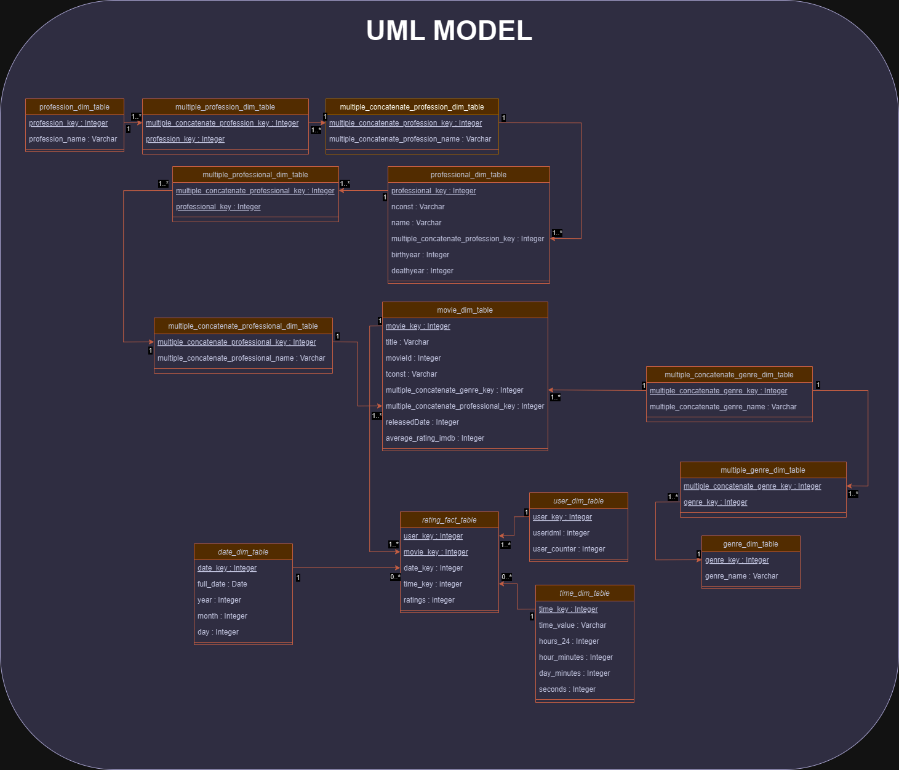
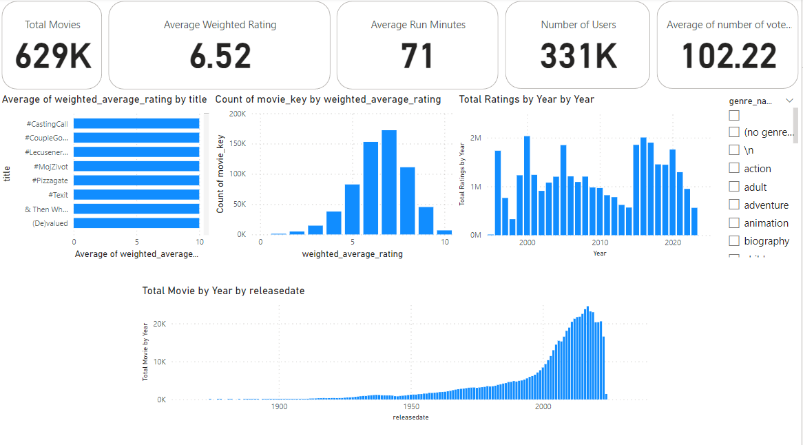

# Movie Ratings Data Warehouse

## Introduction

This project was carried out as part of the "Handling and Analysis of Large Data Volumes" course at the Universidad de Zaragoza (UniZar). The objective was to design and analyze a Data Warehouse for movie ratings using advanced visualization techniques.

## Table of Contents

- [Context and Motivation](#context-and-motivation)
- [Kimball Process](#kimball-process)
  - [Selecting the Business Process](#selecting-the-business-process)
  - [Declaring the Grain](#declaring-the-grain)
  - [Choosing Dimensions](#choosing-dimensions)
  - [Identifying the Facts](#identifying-the-facts)
- [ETL Process](#etl-process)
  - [Choosing the ETL Tool](#choosing-the-etl-tool)
  - [Choosing the Database Server](#choosing-the-database-server)
  - [Choosing the Dataset](#choosing-the-dataset)
  - [Data Extraction and Insertion](#data-extraction-and-insertion)
  - [SQL Procedures](#sql-procedures)
- [Data Analysis with PowerBI](#data-analysis-with-powerbi)
  - [Creating Views](#creating-views)
  - [Integration into PowerBI](#integration-into-powerbi)
  - [Visualization and Analysis](#visualization-and-analysis)
- [Demonstrated Skills](#demonstrated-skills)
- [Conclusion](#conclusion)
- [Access to the GitHub Repository](#access-to-the-github-repository)

## Context and Motivation

This project was carried out to put into practice the concepts learned in class by designing a complete Data Warehouse system and using advanced data analysis techniques.

## Kimball Process

### Selecting the Business Process

The business process selected for this project is the analysis of movie ratings by users and actors.

### Declaring the Grain

The grain of the Data Warehouse is defined at the level of ratings given by a user for a movie on a specific date.

### Choosing Dimensions

The dimensions chosen for this project include users, movies, dates, and times, providing a rich context around each rating.

### Identifying the Facts

The main fact is the rating given by users for movies on a specific date.

## ETL Process

The ETL (Extract, Transform, Load) process is fundamental for data management. It allows collecting data from various sources, transforming it, and loading it into a database for analysis.

### Choosing the ETL Tool

I chose Apache HOP for its flexibility and performance.

### Choosing the Database Server

PostgreSQL was chosen for its reliability and performance.

### Choosing the Dataset

The datasets [IMDB](https://developer.imdb.com/non-commercial-datasets/) and [MovieLens](https://grouplens.org/datasets/movielens/) were used to obtain movie ratings as well as information on actors and directors.

### Data Extraction and Insertion

I used Apache HOP to extract data from CSV files and insert it into PostgreSQL. Dedicated workflows were created for each source table to ensure precise extraction and insertion.

For more details, you can check the workflow and various pipelines:
- [Workflow and pipelines on Apache Hop](https://github.com/nasser-chaouchi/movie-ratings-datawarehouse/tree/main/ApacheHOP)

### SQL Procedures

SQL procedures were programmed to efficiently transform and load the data. Here are some of the procedures used:

- sp_date_dim_table
- sp_genre_dim_table
- sp_movie_dim_table
- sp_multiple_concatenate_genre_dim_table
- sp_multiple_concatenate_profession_dim_table
- sp_multiple_concatenate_professional_dim_table
- sp_multiple_genre_dim_table
- sp_multiple_profession_dim_table
- sp_multiple_professional_dim_table
- sp_profession_dim_table
- sp_professional_dim_table
- sp_rating_fact_table
- sp_time_dim_table
- sp_user_dim_table

For more details, you can check the source code of the procedures:
- [Source code of the procedures](https://github.com/nasser-chaouchi/movie-ratings-datawarehouse/tree/main/PostgreSQL/procedures)

## Data Analysis with PowerBI

To facilitate data analysis, I integrated the transformed data into PowerBI, allowing for interactive and detailed visualizations.

### Creating Views

To organize the data for PowerBI, I created several views in PostgreSQL.

- date_dim_view
- genre_dim_view
- movie_dim_view
- movie_dim_with_ratings
- movie_rating_aggregates
- multiple_concatenate_genre_dim_view
- multiple_concatenate_profession_dim_view
- multiple_concatenate_professional_dim_view
- multiple_genre_dim_view
- multiple_profession_dim_view
- multiple_professional_dim_view
- profession_dim_view
- professional_dim_view
- rating_fact_view
- time_dim_view
- user_dim_view

For more details, you can check the source code of the views:
- [Source code of the views](https://github.com/nasser-chaouchi/movie-ratings-datawarehouse/tree/main/PostgreSQL/views)

### Integration into PowerBI

Once the views were created, I exported the data to CSV files to import them into PowerBI.

### Visualization and Analysis

In PowerBI, I created several dashboards to analyze movie ratings from different perspectives:

- General View: Visualization of average ratings, total number of movies, number of users, etc.
- IMDB View: Specific analysis of ratings from IMDB.
- MovieLens View: Specific analysis of ratings from MovieLens.

## Demonstrated Skills

This project allowed me to develop and demonstrate several technical and analytical skills:
- Data Warehouse design and modeling
- Using Apache HOP for managing ETL processes
- Advanced SQL programming
- Using PostgreSQL
- Data analysis and visualization with PowerBI
- Handling large datasets
- Documenting and sharing projects on GitHub

## Conclusion

This project enabled the design of a complete Data Warehouse for analyzing movie ratings, using proven methodologies and powerful tools like Apache HOP and PostgreSQL. Integrating the data into PowerBI provided a robust platform for data visualization and analysis, yielding detailed and useful insights.
